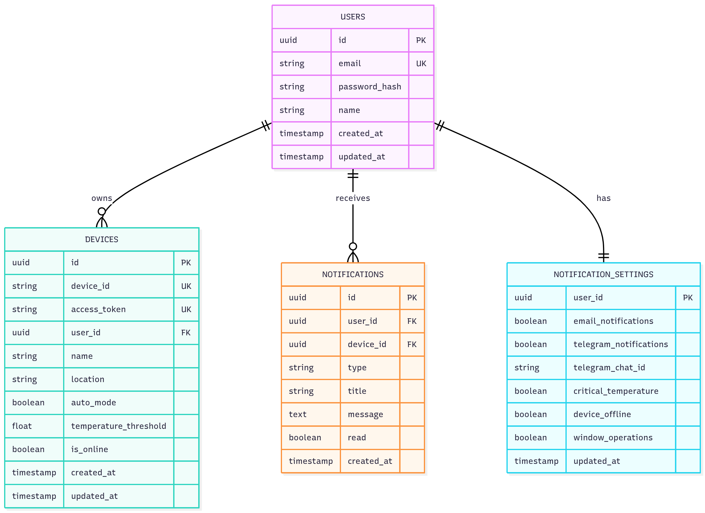

# Диаграмма сущность-связь (ERD) для системы "Умная теплица"

## Описание сущностей

### USERS (Пользователи)
Хранит информацию о зарегистрированных пользователях системы.

**Атрибуты:**

- `id` (UUID) - Уникальный идентификатор пользователя (первичный ключ)
- `email` (string) - Email пользователя (уникальный)
- `password_hash` (string) - Хэш пароля пользователя
- `name` (string) - Имя пользователя
- `created_at` (timestamp) - Дата и время регистрации
- `updated_at` (timestamp) - Дата и время последнего обновления

### DEVICES (Устройства)
Хранит информацию о тепличных устройствах, привязанных к пользователям.

**Атрибуты:**

- `id` (UUID) - Уникальный идентификатор записи (первичный ключ)
- `device_id` (string) - ID устройства в ThingsBoard (уникальный)
- `access_token` (string) - Токен доступа устройства (уникальный)
- `user_id` (UUID) - Ссылка на пользователя (внешний ключ к USERS.id)
- `name` (string) - Название устройства/теплицы
- `location` (string) - Расположение устройства
- `auto_mode` (boolean) - Флаг автоматического режима управления
- `temperature_threshold` (float) - Порог температуры для автоматического проветривания
- `is_online` (boolean) - Статус онлайн устройства
- `created_at` (timestamp) - Дата и время добавления устройства
- `updated_at` (timestamp) - Дата и время последнего обновления

### NOTIFICATIONS (Уведомления)
Хранит историю уведомлений для пользователей.

**Атрибуты:**

- `id` (UUID) - Уникальный идентификатор уведомления (первичный ключ)
- `user_id` (UUID) - Ссылка на пользователя (внешний ключ к USERS.id)
- `device_id` (UUID) - Ссылка на устройство (внешний ключ к DEVICES.id, опционально)
- `type` (string) - Тип уведомления (temperature_alert, humidity_alert, device_offline, window_status)
- `title` (string) - Заголовок уведомления
- `message` (text) - Текст уведомления
- `read` (boolean) - Флаг прочтения уведомления
- `created_at` (timestamp) - Дата и время создания уведомления

### NOTIFICATION_SETTINGS (Настройки уведомлений)
Хранит настройки уведомлений для каждого пользователя.

**Атрибуты:**

- `user_id` (UUID) - Ссылка на пользователя (первичный ключ, внешний ключ к USERS.id)
- `email_notifications` (boolean) - Флаг уведомлений по email
- `telegram_notifications` (boolean) - Флаг уведомлений через Telegram
- `telegram_chat_id` (string) - ID чата Telegram для отправки уведомлений
- `critical_temperature` (boolean) - Флаг уведомлений о критической температуре
- `device_offline` (boolean) - Флаг уведомлений об отключении устройства
- `window_operations` (boolean) - Флаг уведомлений об операциях с окном
- `updated_at` (timestamp) - Дата и время последнего обновления настроек

## Связи между сущностями

1. **USERS ||--o{ DEVICES** - Один пользователь может иметь несколько устройств (один-ко-многим)
2. **USERS ||--o{ NOTIFICATIONS** - Один пользователь может иметь много уведомлений (один-ко-многим)
3. **USERS ||--|| NOTIFICATION_SETTINGS** - У каждого пользователя одна запись настроек (один-к-одному)